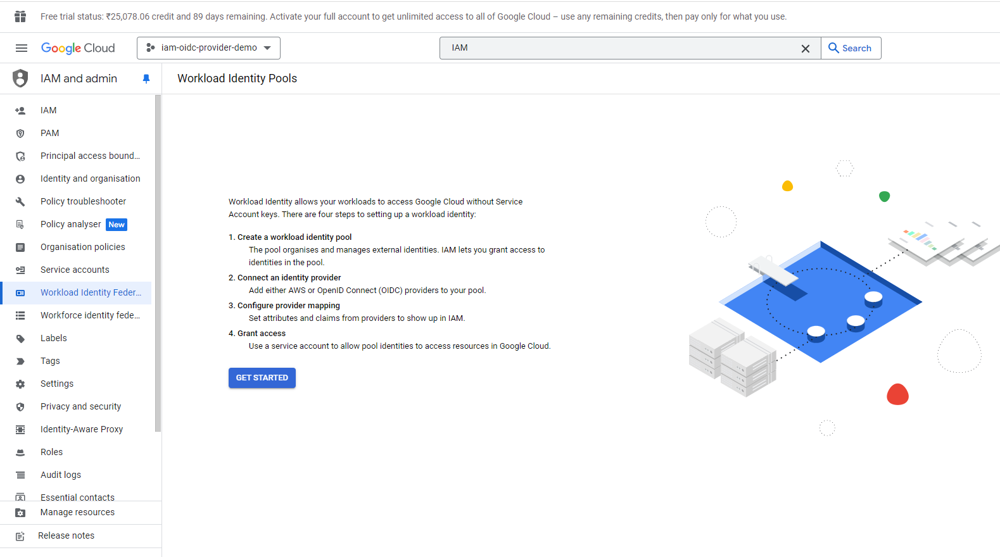
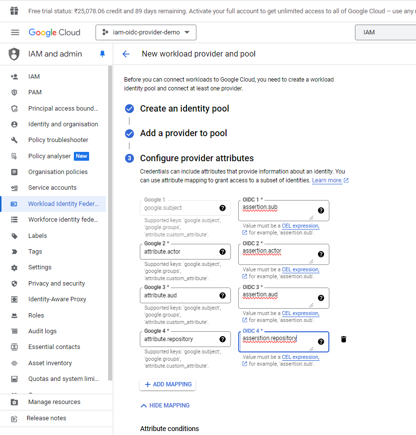
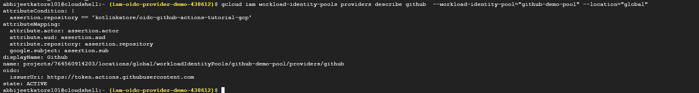
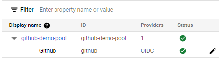
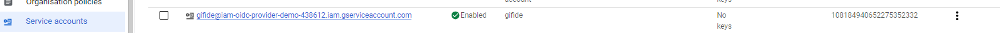
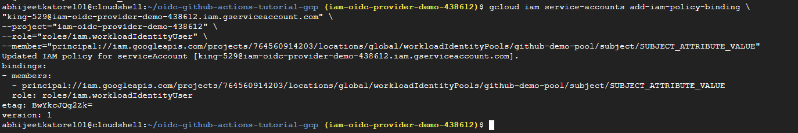
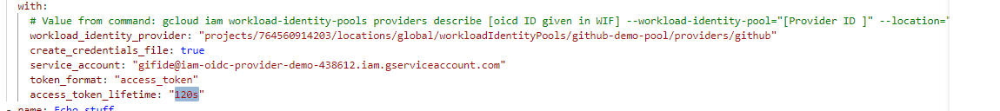

The command you provided, `gcloud iam workload-identity-pools providers describe github --workload-identity-pool="github-demo-pool" --location="global"`, describes a workload identity pool provider named "github" within the "github-demo-pool" located in the global region.

Here's a breakdown of what the command does:

* **`gcloud iam workload-identity-pools providers describe`**: This part of the command specifies the operation you want to perform. It's instructing the `gcloud` tool to interact with workload identity pool providers and use the `describe` subcommand.
* **`github`**: This is the name of the specific workload identity pool provider you want information about.
* **`--workload-identity-pool="github-demo-pool"`**: This option specifies the workload identity pool that contains the provider named "github."
* **`--location="global"`**: This option indicates the location of the workload identity pool (in this case, global).

The output you received shows the details of the "github" provider. Let's break down the key components:

* **`attributeCondition`**: This section defines a condition that must be met for an external identity (like a GitHub user) to be mapped to a Google Cloud identity. In this case, the condition checks if the `assertion.repository` attribute (likely coming from a GitHub Actions token) matches the specific repository `kotlinkatore/oidc-github-actions-tutorial-gcp`. This ensures only users accessing that specific repository can leverage this provider.
* **`attributeMapping`**: This section specifies how attributes from the external identity token (issued by GitHub Actions) are mapped to Google Cloud identity attributes. This allows Google Cloud to understand the user and their permissions based on the information in the token.
* **`displayName`**: This is a user-friendly name assigned to the provider, in this case, "Github."
* **`name`**: This is the full resource name of the provider within GCP.
* **`oidc`**: This section defines the OpenID Connect (OIDC) configuration for the provider. It specifies the `issuerUri` which is the URL where Google Cloud can validate the identity token from GitHub Actions.
* **`state`**: This indicates the current state of the provider. In this case, it's "ACTIVE," meaning the provider is ready to be used for mapping external identities.

In simpler terms, this workload identity pool provider allows Google Cloud to securely connect with users accessing a specific GitHub repository (`kotlinkatore/oidc-github-actions-tutorial-gcp`) through GitHub Actions. By mapping the user information from the GitHub Actions token, Google Cloud can grant appropriate permissions based on the user's role within the repository.

service account


binding, 
```
gcloud iam service-accounts add-iam-policy-binding \
"king-529@iam-oidc-provider-demo-438612.iam.gserviceaccount.com" \
--project="iam-oidc-provider-demo-438612" \
--role="roles/iam.workloadIdentityUser" \
--member="principal://iam.googleapis.com/projects/764560914203/locations/global/workloadIdentityPools/github-demo-pool/subject/SUBJECT_ATTRIBUTE_VALUE"
```


